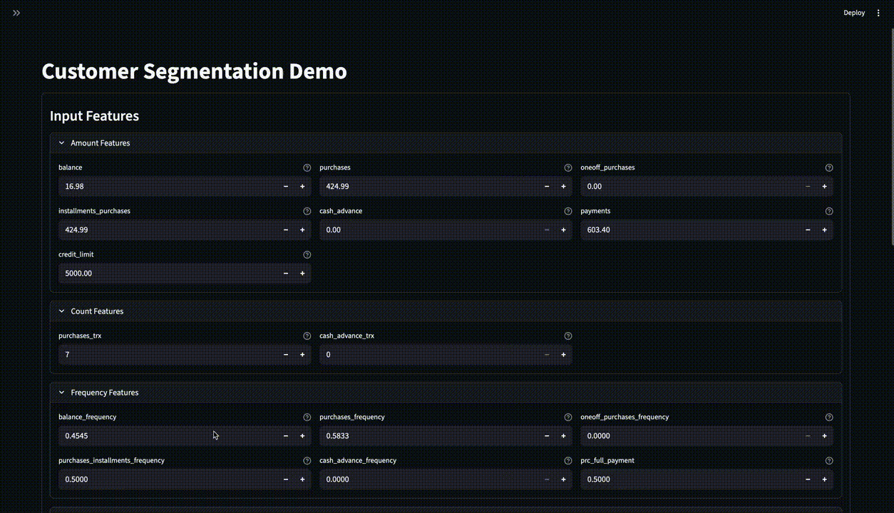
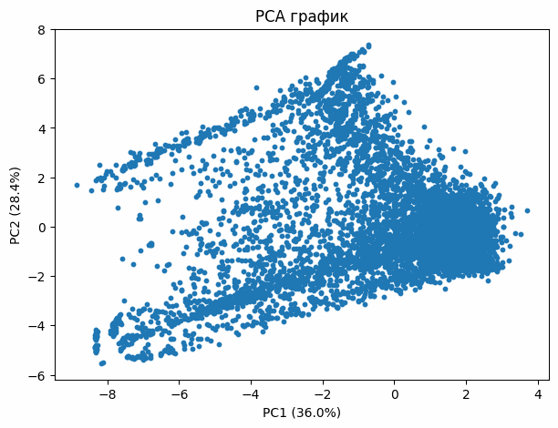

# Customer Segmentation Project


An interactive customer-segmentation project with offer matching.
Full MLOps loop: data loading -> training -> experiment tracking -> batch scoring -> interactive visualization.

## Screen Recording 


If the video does not render, open the file directly: `exmp/app_recording_update.gif`.

---

## What is implemented
- **Training pipeline** (K-Means + preprocessing, PCA for visualization).
- **MLflow**: metrics, models, and artifacts logging.
- **Airflow DAG**: init DB -> load CSV -> train -> batch scoring.
- **PostgreSQL**: storage for features and segmentation results.
- **Streamlit**: input form, similar-customer generation by cluster, PCA visualization, train/refresh button.
- **Segment offers**: curated offers for 4 clusters.

---

## Tech stack
- **ML / Data**: scikit-learn, pandas, numpy
- **MLOps**: MLflow
- **Orchestration**: Airflow
- **Database**: PostgreSQL
- **UI**: Streamlit
- **Infra**: Docker Compose

---

## How the project was built (story)
I started with a fast exploratory pass to understand the data shape: heavy-tailed monetary features, frequency variables bounded in [0, 1], and a small number of missing values.
Based on that, I designed a clean preprocessing pipeline (imputation + robust scaling) so that models would be stable and comparable across runs.

Next, I used PCA to make the customer space visible and interpretable in 2D. This gave a consistent view for diagnostics and for the app UI.
With preprocessing and visualization in place, I compared multiple clustering algorithms (K-Means, DBSCAN, HDBSCAN, Agglomerative, GMM, Spectral) using internal validation metrics.
K-Means with k=4 delivered the best balance between quality and business interpretability, so it became the fixed model in the product logic.

Once the modeling decision was clear, I wrapped it with MLOps: MLflow logs metrics, models, and artifacts; Airflow orchestrates loading, training, and batch scoring.
Finally, I built the Streamlit app so the workflow becomes tangible: users can generate a realistic customer profile, validate inputs, predict a segment, and see the PCA position live.

---

## Dataset snapshot
- **File**: `data/Customer Data.csv`
- **Size**: 8,950 customers x 18 columns (1 ID + 17 numeric features)
- **Missing values**: 314 values (0.195%), mostly `MINIMUM_PAYMENTS` and 1 in `CREDIT_LIMIT`
- **Feature examples**: balance, purchases, cash advance, transaction frequencies, payments, credit limit, tenure
- **Source**: Kaggle dataset *Market Segmentation in Insurance (Unsupervised)*
- **Authors**: Jillani Soft Tech
- **License**: Open Database License (ODbL) for the database, Open Database Contents for contents

## Dataset download
The dataset is not stored in git. Download it from Kaggle and place it here:
```
data/Customer Data.csv
```

**Option A: Kaggle CLI**
```bash
kaggle datasets download -d market-segmentation-in-insurance-unsupervised -p data
unzip -o data/market-segmentation-in-insurance-unsupervised.zip -d data
rm -f data/market-segmentation-in-insurance-unsupervised.zip
```

**Option B: Manual**
1. Open the Kaggle dataset page (search for **market-segmentation-in-insurance-unsupervised**).
2. Download the zip and extract it.
3. Copy `Customer Data.csv` into `data/`.

Kaggle source:
```
https://www.kaggle.com/datasets/jillanisofttech/market-segmentation-in-insurance-unsupervised
```

---

## Quickstart

### 1) Start infrastructure
```bash
docker compose up -d
```

### 2) Trigger the pipeline (Airflow)
```bash
docker exec -it segmentation-airflow airflow dags trigger train_and_score
```

### 3) Run Streamlit (locally)
```bash
streamlit run src/app/streamlit_app.py
```

### 4) Open interfaces
- **Airflow**: http://localhost:8080 (login/password: admin/admin)
- **MLflow**: http://localhost:5000
- **Streamlit**: http://localhost:8501

---

## How to use (Streamlit)
1. Verify `DB_URI` and `MLFLOW_TRACKING_URI` (defaults are set).
2. Click **Train / Refresh** to train and update model URIs.
3. Generate a **similar customer by cluster** or enter values manually.
4. Click **Predict** to see segment, offer, and PCA position.

---

## Results and model selection (from notebook)

### Algorithm comparison (PCA space)
| Algorithm | Silhouette (higher) | Davies-Bouldin (lower) | Calinski-Harabasz (higher) |
|---|---:|---:|---:|
| K-Means | 0.314 | 1.079 | 4730.614 |
| DBSCAN | -0.483 | 1.389 | 57.600 |
| HDBSCAN | -0.302 | 1.304 | 74.837 |
| Agglomerative | 0.286 | 1.079 | 4211.523 |
| Gaussian Mixture | 0.118 | 2.078 | 1467.233 |
| Spectral | 0.389 | 0.971 | 1882.962 |

### k selection for K-Means
| k | Silhouette (higher) | Davies-Bouldin (lower) | Calinski-Harabasz (higher) |
|---:|---:|---:|---:|
| 2 | 0.373 | 1.498 | 3451.055 |
| 3 | 0.211 | 1.486 | 2639.278 |
| **4** | **0.277** | **1.202** | **4014.024** |
| 5 | 0.253 | 1.343 | 3531.523 |
| 6 | 0.269 | 1.256 | 3153.843 |
| 7 | 0.254 | 1.324 | 3101.636 |
| 8 | 0.206 | 1.437 | 2558.256 |
| 9 | 0.218 | 1.337 | 2592.491 |

**Why K-Means (k=4):**
A practical balance between quality and interpretability.
Four clusters map directly to four offers, so k=4 is fixed in the product logic.

---

## Key insights
- **4 stable behavioral segments**: active transactors, revolvers, low activity, cash-advance/high-risk.
- **PCA captures a large share of variance**: PC1 ~ 36%, PC2 ~ 28% (clear separation in the visualization).
- **Clusters are offer-ready**: each segment is tied to a specific product and UX logic.
- **K-Means wins on balance of quality and explainability**, even when some metrics are higher for other methods.

---

## Architecture
```
CSV -> Postgres (customer_features)
    -> Airflow (train_and_score DAG)
        -> MLflow (experiments + models)
        -> Postgres (customer_segments)
Streamlit -> prediction + visualization
```

---

## Challenges and fixes
- **MLflow artifacts would not download**
  Fixed by `--serve-artifacts` and a dedicated `artifact_location`.

- **Local Postgres port conflict**
  Docker Postgres moved to **5433** to avoid clashing with system services.

- **scikit-learn version mismatch**
  Aligned to 1.3.2 in the container and local environment.

- **Streamlit state after generation**
  Fixed by updating inputs before widget creation.

---

## Charts and visuals (from notebook)

